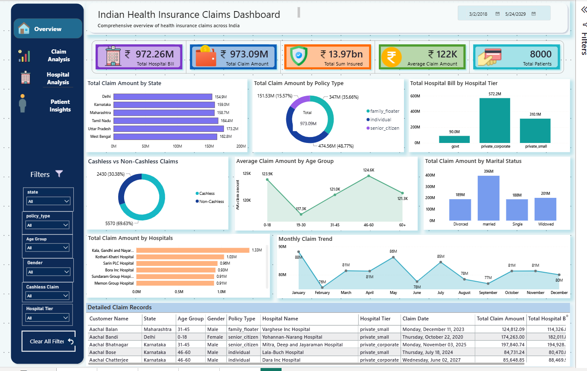

# 🏥 Indian Health Insurance Dashboard

## 📌 Project Overview
This project is an interactive Power BI dashboard built to analyze Indian Health Insurance claims. It provides insights into claim trends, patient demographics, hospital performance, and insurance metrics to support data-driven decision-making.

---

## 🎯 Objectives
- Analyze health insurance claims
- Monitor claim approval and rejection trends
- Identify high-cost treatments and hospitals
- Compare claims across states and demographics
- Build an executive-level interactive dashboard

---

## 🛠 Tools & Technologies
- Power BI
- Power Query
- DAX
- Microsoft Excel / CSV

---

## 📊 Dashboard Features
- Executive KPI Cards
- Interactive Slicers
- Drill-through Analysis
- Dynamic Filters
- State-wise Analysis
- Hospital Performance Analysis
- Patient Demographics
- Claim Status Analysis
- Financial Overview

---

## 📈 Key KPIs
- Total Claims
- Total Claim Amount
- Average Claim Amount
- Total Hospital Bills
- Average Patient Age
- Total Patients
- Claim Approval Rate
- Claim Rejection Rate

---

## 📷 Dashboard Preview

---

## 🎥 Demo Video

See the dashboard walkthrough in **Demo.mp4**.

---

## 📂 Repository Contents

- `Indian_Health_Insurance.pbix`
- `Dashboard.png`
- `Demo.mp4`

---

## 🚀 How to Use

1. Download the repository.
2. Open `Indian_Health_Insurance.pbix` in Power BI Desktop.
3. Refresh the data if required.
4. Explore the interactive dashboard.

---

## 📌 Skills Demonstrated

- Data Cleaning
- Data Transformation
- Data Modeling
- DAX Measures
- Dashboard Design
- Data Visualization
- Business Intelligence
- Interactive Reporting

---
## 👨‍💻 Author

**Vishal Chindarkar**

📧 Open to Data Analyst opportunities

🔗 GitHub: https://github.com/VishalChindarkar

💼 LinkedIn: www.linkedin.com/in/vishal-chindarkar-20286639b
